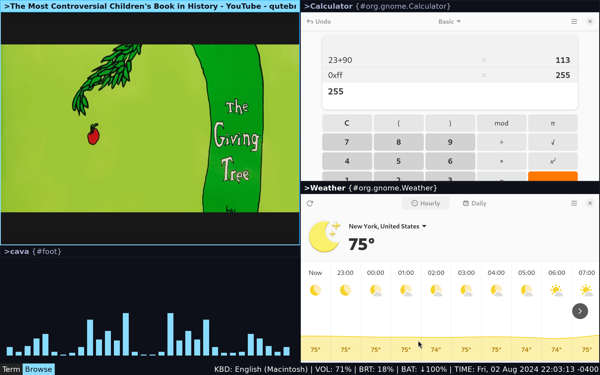

# Sway WM Configuration

## About

[`Sway`](https://swaywm.org) is a [tiling](https://en.wikipedia.org/wiki/Tiling_window_manager) window manager for Wayland that emulates the features of [`i3wm`](https://i3wm.org/), plus some extra features.

Sway user configuration is located at either `$XDG_CONFIG_DIR/sway/config` or `~/.config/sway/config`. It is written in what appears to be a custom language. 

## Dependencies

### Fonts (Not needed)

* [DejaVu Sans](https://dejavu-fonts.github.io)
    * Normal and bold weights

### Apps

* [bemenu](https://github.com/cloudef/bemenu) (dmenu alternative for Wayland)
* chromium
* Firefox (optional)
* [swaylock](https://github.com/swaywm/swaylock) (screen locker for swaywm)
* [foot](https://codeberg.org/dnkl/foot) minimalist terminal emulator for Wayland
